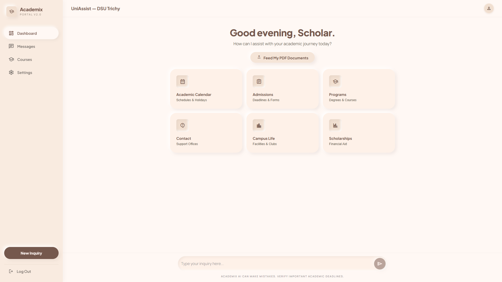

# Academix — AI University Portal



### 🌍 **[Live Demo: Try Academix Portal](https://university-chatbot-langchain.vercel.app)**

## Overview
A powerful AI-powered academic portal designed for university environments. This intelligent assistant provides accurate responses using your university's own documents (PDF, TXT, DOCX) and even handwritten notes (JPG/PNG) via Vision OCR, leveraging **Groq's** high-speed Llama 3 models.

## Features
- 📚 **Multi-Format RAG**: Process PDF, TXT, and DOCX university documents.
- 👁️ **Vision OCR**: Upload photos of handwritten notes; the AI "reads" them using Llama 3.2 Vision.
- 🎨 **Tactile Minimalism**: A premium neumorphic React UI designed for a professional student portal experience.
- 📝 **Source Citation**: Transparently links every answer back to the specific document it used.
- ⚡ **Instant Inference**: Powered by **Groq** (llama-3.3-70b) for sub-second response times.
- 🔐 **Privacy Focused**: Documents remain in your local `data/` directory.

## Prerequisites

- **Python 3.8+**
- **Node.js 14+** (for frontend)
- **Groq API Key** - Get it free at [console.groq.com](https://console.groq.com)

## Installation

### 1. Backend Setup (FastAPI)

1. **Clone the repository**:
```bash
git clone https://github.com/shantoshdurai/university-chatbot-langchain.git
cd university-chatbot-langchain
```

2. **Configure Environment**:
Create a `.env` file from the example:
```bash
cp .env.example .env
```
Edit `.env` and add your key: `GROQ_API_KEY=gsk_...`

3. **Install Dependencies**:
```bash
python -m venv venv
# On Windows:
.\venv\Scripts\activate
# On Mac/Linux:
source venv/bin/activate

pip install -r requirements.txt
```

4. **Run Server**:
```bash
python api.py
```

### 2. Frontend Setup (React)

1. **Navigate to frontend**:
```bash
cd chatbot-frontend
```

2. **Install Node dependencies**:
```bash
npm install
```

3. **Configure Frontend**:
```bash
cp .env.local.example .env.local
```

4. **Start Web Portal**:
```bash
npm start
```

## Usage
- **Dashboard**: Ask general questions about the university.
- **Feed Documents**: Use the "Feed My PDF Documents" button to upload new calendars, hand-written notes, or catalogs.
- **Messages**: Access your conversation history.
```

## Usage

1. **Place your documents** in the `data` directory:
   - Supported formats: PDF, TXT, DOCX, MD
   - Can include any university-related documents

2. **Start the chatbot**:
```bash
python chatbot.py
```

3. **Start chatting**:
   - Type your questions and press Enter
   - The bot will process your documents and provide answers
   - Sources will be cited for transparency

4. **Commands**:
   - Type `exit` to quit the application
   - Type `clear` to clear the screen

## Example Use Cases

This chatbot can help answer questions about:
- 📚 Course catalogs and curriculum information
- 📅 Academic calendars and important dates
- 📖 University handbooks and policies
- 🏛️ Department guides and faculty information
- 🎉 Event schedules and activities
- 📜 Policy documents and regulations
- 🏫 Admission requirements and procedures
- 📊 Grading systems and academic standards

## Example Documents

You can add various university-related documents such as:
- Course catalogs
- Academic calendars  
- University handbooks
- Department guides
- Event schedules
- Policy documents
- Student resources
- Faculty directories

## Project Structure
```
langchainofdsu/
├── data/              # Place your documents here
├── chatbot.py         # Main chatbot script
├── requirements.txt   # Python dependencies
├── venv/              # Virtual environment
└── README.md          # Project documentation
```

## Troubleshooting

### Ollama not running
- **Solution**: Make sure to run `ollama serve` in a terminal before starting the chatbot

### Model not found
- **Solution**: Run `ollama pull llama3.1:8b` to download the model

### Document not loading
- **Solution**: Ensure your files are in a supported format (PDF, TXT, DOCX, MD) and placed in the `data` directory

### Installation issues
- **Solution**: Ensure you have Python 3.8+ and all required packages installed via `pip install -r requirements.txt`

### Memory errors
- **Solution**: If you have many large documents, consider processing them in batches

## Customization

You can customize the chatbot's behavior by modifying the `system_message` in `chatbot.py`. This controls:
- How the assistant responds to questions
- The tone and style of responses
- Special instructions for handling specific types of queries

## Performance Tips

1. **Document Quality**: Use well-formatted documents for better results
2. **File Size**: Keep individual files under 50MB for optimal processing
3. **Chunking**: The system automatically chunks large documents for better retrieval
4. **Local LLM**: Using Ollama locally ensures data privacy and faster responses

## Contributing

Contributions are welcome! Please feel free to submit issues and pull requests.

1. Fork the repository
2. Create your feature branch (`git checkout -b feature/AmazingFeature`)
3. Commit your changes (`git commit -m 'Add some AmazingFeature'`)
4. Push to the branch (`git push origin feature/AmazingFeature`)
5. Open a Pull Request

## License

This project is licensed under the MIT License - see the LICENSE file for details.

## Contact

Developer: Shantosh Durai  
GitHub: [@shantoshdurai](https://github.com/shantoshdurai)

## Acknowledgments

- [LangChain](https://langchain.com/) for the powerful LLM framework
- [Ollama](https://ollama.ai/) for local LLM deployment
- The open-source community for continuous support

## Support

If you find this project helpful, please consider giving it a star ⭐ on GitHub!
